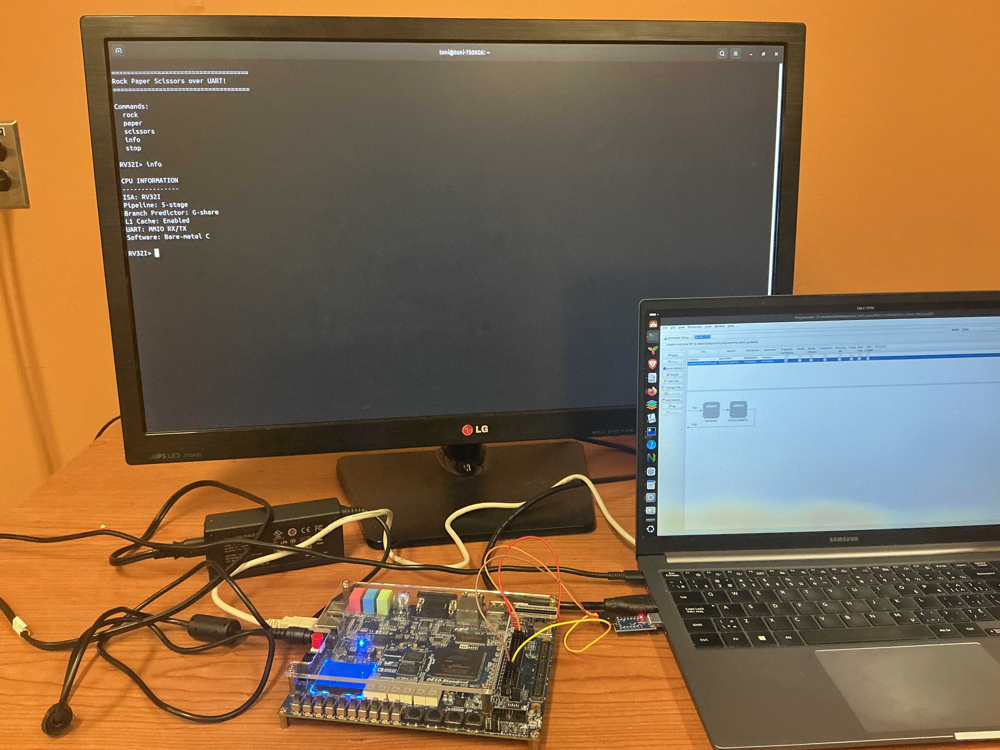

# RV32I Processor on FPGA

A 32-bit RISC-V processor designed from the ground up in Verilog and targeted at an Intel Cyclone V FPGA. The project combines a five-stage pipelined CPU, dynamic branch prediction, a set-associative L1 data cache, and memory-mapped peripherals into a small bare-metal system.

Most importantly, this processor runs **real C programs compiled with GCC**. C source is compiled for `RV32I`, linked with custom startup code and a linker script, loaded into the processor's instruction and data memories, and executed directly by the RTL. The current demonstration is an interactive rock-paper-scissors game written in C and played through a serial terminal over UART.

## C Running on the Processor

_Terminal screenshot placeholder: C rock paper scissors game running on the processor over UART._

## Architecture

<!-- Add the architecture block diagram here. Suggested Markdown:

-->

_Block diagram placeholder: processor pipeline, memories, cache, and MMIO subsystem._

The design includes:

- A classic five-stage `IF-ID-EX-MEM-WB` pipeline
- Forwarding, load-use hazard detection, pipeline stalls, and control-flow flushing
- A gshare-style dynamic branch predictor with a branch target buffer
- A four-way set-associative, write-back L1 data cache
- Separate instruction and data memories using a Harvard architecture
- A load/store unit with uncached memory-mapped I/O
- An APB3 peripheral bridge and configurable UART transmitter/receiver
- A board-level Quartus project for the Cyclone V-based DE10-Standard

## Software Flow 

The software flow uses the RISC-V GCC toolchain with `-march=rv32i -mabi=ilp32`. Custom `crt0` startup code initializes the stack, global pointer, and `.bss` section before calling `main`. A custom linker script places executable code in instruction memory and program data in data memory.

This flow supports non-trivial C features including function calls, recursion, stack usage, global data, strings, software multiplication/division through `libgcc`, and volatile MMIO access. The UART game in `programs/uart.c` exercises this stack end to end, from C code to CPU execution to physical serial I/O.

## Verification

The processor is tested at both module and system level with Icarus Verilog and cocotb. Assembly regressions compare retired instructions and register state against a Python Bus functional ISA model, while self-checking C programs report pass/fail results through a simulation MMIO device. Tests cover arithmetic, branches, forwarding, hazards, sub-word loads/stores, cache misses and write-back, recursive C, and UART transmission.

## Repository Map

- `rtl/` - verilog rtl for the processor, cache, memory, and io peripherals
- `programs/` - C programs and generated FPGA memory images
- `tb/` - Verilog and cocotb verification environments
- `compile_to_mem.py` - compiles a C program into instruction/data memory images
- `RV32I.qpf` / `RV32I.qsf` - Intel Quartus FPGA project

